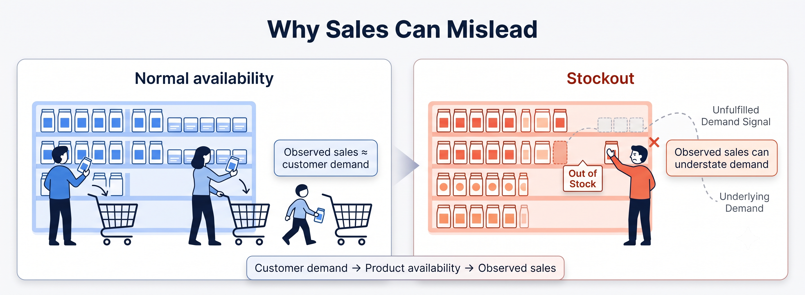

# Stockout-Aware Retail Analytics

**7-day retail forecasting and inventory decision support when observed sales are distorted by stockouts.**

A low-sales day does not always mean low demand. A product may simply have been unavailable.

This project builds an end-to-end workflow to identify stockout exposure, estimate a more useful demand signal, forecast the next 7 days, evaluate inventory scenarios, and prioritize store-product combinations for action.



## Results at a glance

The final forecasting model was evaluated on a completely untouched future week: **26 Jun 2024 – 2 Jul 2024**.

| Result | Value |
|---|---:|
| Final holdout WAPE | **0.3391** |
| Best simple baseline WAPE | **0.3612** |
| Improvement vs. best baseline | **6.12%** |
| Forecast horizons won | **7 / 7** |
| Holdout rows | **350,000** |
| Holdout rows with stockout exposure | **40.98%** |

The strongest simple baseline was a **7-day moving average**.

## What I built

The project connects forecasting with inventory decisions instead of treating forecast accuracy as the final objective.

```text
Retail sales + stockout exposure
            ↓
      Stockout diagnostics
            ↓
   Cross-fitted demand signal
            ↓
      7-day forecasting
            ↓
   Uncertainty calibration
            ↓
    Inventory scenarios
            ↓
   Operational prioritization
```

### 1. Stockout-aware demand reconstruction

Observed sales are treated as a potentially censored demand signal when inventory is unavailable.

I use expanding cross-fitted models so each validation period is predicted from earlier normal-stock observations.

On normal-stock observations:

| Metric | Result |
|---|---:|
| MAE | **0.3150** |
| WAPE | **0.3083** |
| RMSE | **0.5489** |

There were **703,520 stockout observations** with cross-fitted predictions.

For full-stockout observations:

| Measure | Result |
|---|---:|
| Mean observed sales | **0.0514** |
| Mean estimated demand | **1.0277** |
| Mean estimated gap | **0.9781** |

These are **model-based counterfactual estimates**, not directly observed lost sales.

### 2. Seven-day forecasting

The final direct gradient-boosting model was compared with simple baselines on the same untouched holdout.

| Model | WAPE |
|---|---:|
| **Final Gradient Boosting** | **0.3391** |
| 7-day Moving Average | 0.3612 |
| Seasonal Naive (7-day) | 0.4183 |
| Previous-day Naive | 0.4289 |

The final model won all **7 forecast horizons** and had lower absolute error on **55.07%** of paired holdout rows.

### 3. Inventory decision layer

Forecast uncertainty is calibrated using walk-forward validation and then used to test inventory protection scenarios.

For the evaluated **SL90 + 20% risk uplift**:

| Measure | Result |
|---|---:|
| Inventory increase | **3.38%** |
| Simulated shortage reduction | **23.92%** |
| Fill-rate improvement | **0.273 percentage points** |

The benefit is much larger in higher stockout-risk segments:

| Risk band | Simulated shortage reduction |
|---|---:|
| LOW | **4.04%** |
| MEDIUM | **18.04%** |
| HIGH | **29.27%** |
| VERY_HIGH | **45.44%** |

The analysis therefore supports **targeted inventory protection** rather than applying the same uplift everywhere.

### 4. Operational risk prioritization

The risk layer scores **50,000 store-product series** and turns the results into an action queue.

| Segment | Series |
|---|---:|
| CRITICAL | **500** |
| HIGH_PRIORITY | **2,000** |
| MONITOR | **5,000** |
| STANDARD | **42,500** |

Estimated censored-demand exposure is concentrated in the highest-risk part of the portfolio:

- Top 1%: **10.61%**
- Top 5%: **30.74%**

## Validation

The project was built around out-of-time validation and leakage control.

The final holdout was not used for:

- model fitting
- hyperparameter tuning
- feature construction
- baseline construction
- risk assignment

Additional checks cover:

- temporal leakage
- cross-fitted reconstruction
- walk-forward uncertainty calibration
- reconstruction sensitivity
- inventory policy stability
- risk-band monotonicity
- final holdout integrity

Current automated test result:

```text
25 passed
```

## Reconstruction robustness

Because true demand during a stockout is not observed, the reconstruction was stress-tested with shrinkage and prediction caps.

| Check | Result |
|---|---:|
| Minimum Top-1% overlap | **66.40%** |
| Minimum Top-5% overlap | **86.86%** |
| Minimum rank correlation | **0.9466** |
| P99 aggregate gap change | **-10.01%** |

**Decision: Pass with caution.**

The overall signal is directionally stable, but exact demand magnitude and business ranking can change under more conservative assumptions.

## Dashboard

The Streamlit dashboard turns the analysis into a decision-oriented interface covering:

- why stockouts can mislead sales analysis
- final forecast performance
- demand reconstruction
- inventory trade-offs
- operational risk priorities
- methodology and limitations

Run locally:

```cmd
streamlit run dashboard\dashboard.py
```

The dashboard reads its prepared artifacts from:

```text
data/processed/dashboard/
```

## Repository structure

```text
stockout-aware-retail-analytics/
├── data/
│   ├── raw/
│   └── processed/
│       ├── dashboard/
│       └── README.md
├── src/
│   └── stockout_retail/
│       ├── data/
│       ├── features/
│       ├── forecasting/
│       ├── reconstruction/
│       ├── inventory/
│       └── risk/
├── notebooks/
│   ├── 01_dataset_audit.py
│   ├── ...
│   └── 22_final_executive_synthesis.py
├── dashboard/
│   ├── dashboard.py
│   ├── dashboard_assets/
│   └── run_dashboard_final.bat
├── tests/
├── outputs/
├── requirements.txt
├── README.md
├── .gitignore
└── LICENSE
```

## Quick start

Python version used during development and validation:

```text
Python 3.13.3
```

Create and activate a virtual environment:

```cmd
python -m venv .venv
.venv\Scripts\activate
```

Install dependencies:

```cmd
pip install -r requirements.txt
```

Set the source path in Windows Command Prompt:

```cmd
pip install -e .
```

Run the tests:

```cmd
python -m pytest -q
```

Run the dashboard:

```cmd
streamlit run dashboard\dashboard.py
```

The numbered scripts in `notebooks/` document the analysis from the initial data audit through final executive synthesis.

## Data

The original retail dataset and large intermediate analytical outputs are not committed to the public repository.

Dashboard-ready artifacts are kept separately under:

```text
data/processed/dashboard/
```

Larger local datasets and generated analytical files are excluded through `.gitignore`.

## Limitations

This project has one central identification limit: **true demand during a genuine stockout is not directly observed**.

Therefore:

- reconstructed demand is an estimate, not ground truth
- estimated gaps are not directly observed lost sales
- inventory results are scenario simulations
- actual financial savings were not measured
- the evaluated inventory uplift is not claimed to be globally optimal
- causal reduction in real-world stockouts was not established

The project is intended as **analytical decision support**, not as a production inventory optimization system.

## License

This project is released under the [MIT License](LICENSE).
